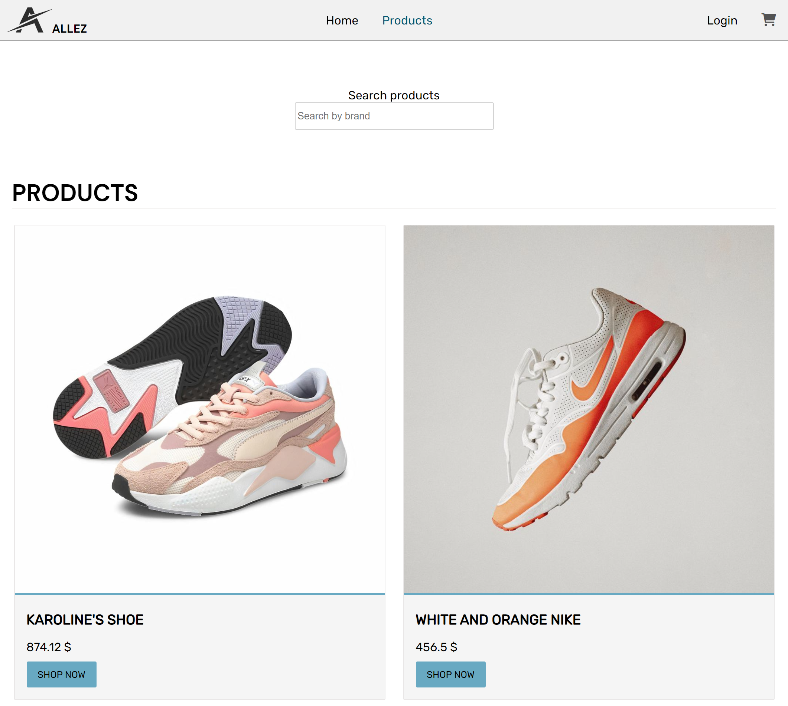

# Allez



This is a website I developed in the second year as a Project delivery at Noroff.

## Description

Allez is an e-commerce website for shoes.

### Project Requirements:

#### Home page
- Hero banner with an image that is uploaded to Strapi.
- A list of featured products.

#### Products page
- List of all products added to Strapi with a set given requirements to title, price, image ect..
- Search bar to filter productes by title or description

#### Details page
"This page is reached by a user clicking on a product on the product list page."
- title, description, image, price
- An add to cart button, this will toggle the product in and out of a cart array stored in local storage.

#### Cart/Basket page
- List of product in your cart/basket
- total price of the products in the cart/basket
- delete items in the cart/basket
- message if there is no items/products in the cart/basket
- There was no requirements to add a CHECKOUT/PAYMENT page on this project.

#### Admin Section (the biggest part of the project)
- Login/Logout to adminpage
- Usage of LocalStorage to keep the user logged in
- Add/edit products
- delete products

## Built with:

- Structured with HTML
- All functionality is created in vanilla JS.
- Styling is done with CSS
- Strapi API for the products.
- Designed in Adobe XD

## Getting Started

### Installing

1. Clone the repo:

```bash
git clone git@github.com:KThomiss/kristian-thomassen-semester-project-2.git
```

2. Open in live server


